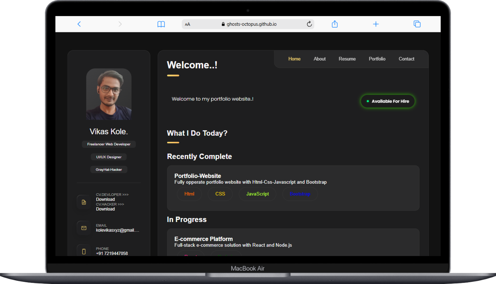

# Portfolio Website 🔥

:star: || For Client of Big-Data-Analysit Profiles.  ||

- > Template Name:  Portfolio 
- > Template Author: GHOSTs-OCTOPUS
- > Template Author URI:  https://vikaskoledev.vercel.app/
- > Template URL: 
- > Version: 3.0.0

This is a simple portfolio website template built with HTML, CSS, and JavaScript. It includes a navigation bar, a hero section, a portfolio section, a contact section, and a footer.
## **Screenshots 📸**

## **Features 🎉**
- Responsive design for desktop and tab devices
- Navigation bar with links to different sections
- Hero section with a background image and a title
- Portfolio section with a grid of images and a filter option
- Contact section with a form 
- Footer with social media links
## **Technologies Used 🛠️**
- HTML5
- CSS3
- JavaScript
- Bootstrap
## **Getting Started 🚀**
1. Clone the repository to your local machine.
2. Open the `index.html` file in a web browser.
3. You can customize the website by editing the HTML, CSS, and JavaScript files.
## **Contributing 🤝**
Pull requests are welcome. If you'd like to contribute to this project, please fork the repository and submit a pull request with your changes.
## **License 📜**
This project is licensed under the MIT License.
## **Acknowledgments 🙏**
This project was inspired by the work of [Octopus](https://octopus.github.io/).
## **Contact 📲**
If you have any questions or would like to collaborate, please contact me at [kolevikasxyz@gmail.com](
    mailto:kolevikasxyz@gmail.com).
    